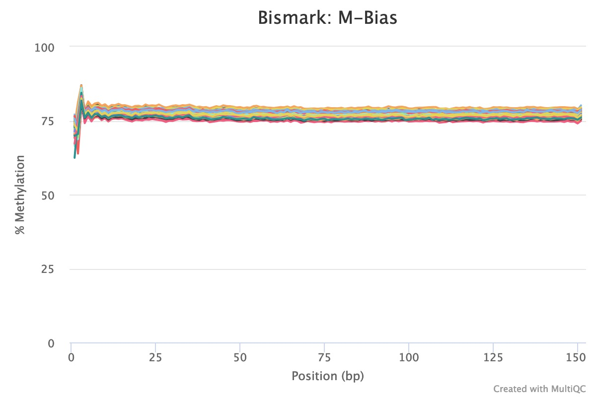
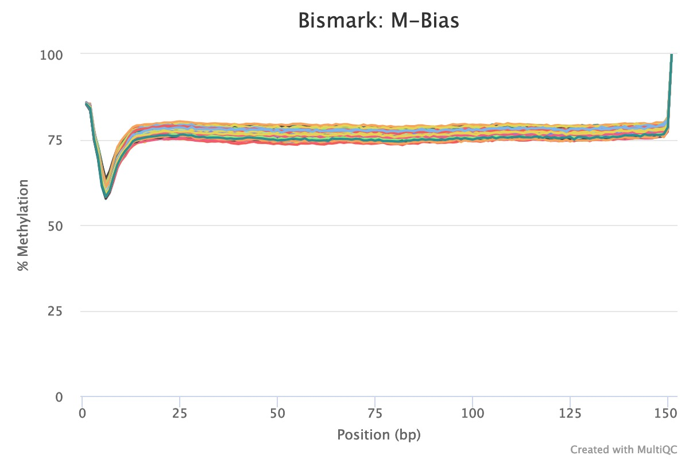

# CpG_Me
#### A whole-genome bisulfite sequencing (WGBS) pipeline for the analysis of DNA methylation

CpG_Me is a WGBS pipeline that takes you from raw fastq files to CpG methylation count matrices (Bismark cytosine reports), where it preprocesses data to remove biases and provides ample QC/QA. Scripts are available for both paired end (PE) and single end (SE) sequencing approaches. The extracted CpG methylation count matrices can be then be used for the identification of differentially methylated regions (DMRs) through the accompanying [DMRichR](https://github.com/ben-laufer/DMRichR) workflow.

### Table of Contents

1. [Overview](https://github.com/ben-laufer/CpG_Me#overview)
2. [Installation](https://github.com/ben-laufer/CpG_Me#installation)
3. [Chastity Filtering](https://github.com/ben-laufer/CpG_Me#chastity-filtering)
4. [Correcting for Methylation Bias (m-bias)](https://github.com/ben-laufer/CpG_Me#correcting-for-methylation-bias-m-bias)
   1. [Paired End (PE)](https://github.com/ben-laufer/CpG_Me#paired-end)
   2. [Single End (SE)](https://github.com/ben-laufer/CpG_Me#single-end)
   3. [M-Bias Examples](https://github.com/ben-laufer/CpG_Me#m-bias-examples)
5. [Paired End (PE) Sequencing](https://github.com/ben-laufer/CpG_Me#paired-end-pe-sequencing)
6. [Single End (SE) Sequencing](https://github.com/ben-laufer/CpG_Me#single-end-se-sequencing)
7. [QC Report](https://github.com/ben-laufer/CpG_Me#qc-report)

8. [Citation](https://github.com/ben-laufer/CpG_Me#citation)
9. [Acknowledgements](https://github.com/ben-laufer/CpG_Me#acknowledgements)

## Overview

A single command line call performs the following steps for all samples:

1. Trim adapters and methylation bias
2. Screen for contaminating genomes
3. Align
4. Remove PCR duplicates
5. Calculate nucleotide frequencies (coverage)
6. Extract CpG methylation
7. Merge symmetric CpG sites
8. Individual sample Quality control and analysis (QC/QA)
9. Legacy file (DSS/DMRfinder) conversion

A final command line call generates html QC/QA reports for all samples that easily enables the identification of failed samples and specifically what went wrong.

## Installation

This workflow utilizes the following packages, which need to be installed and in your path:
1. [Trim Galore!](https://github.com/FelixKrueger/TrimGalore)
2. [Bismark](https://github.com/FelixKrueger/Bismark)
3. [Bowtie 2](http://bowtie-bio.sourceforge.net/bowtie2/index.shtml)
4. [FastQ Screen](https://www.bioinformatics.babraham.ac.uk/projects/fastq_screen/)
5. [Samtools](http://www.htslib.org)
6. [MultiQC](http://multiqc.info)

I recommend using [Bioconda](https://bioconda.github.io) to install and manage the package updates, which can be accomplished by:

`conda install -c bioconda trim-galore bismark bowtie2 samtools fastq-screen multiqc`

Bisulfite converted genomes will also have be created and placed in an external folder for the genome of interest as well as the genomes you would like to use to screen for contamination. This can be accomplished by using `bismark_genome_preparation`, which is detailed in the [Bismark docs](https://github.com/FelixKrueger/Bismark/tree/master/Docs), and example scripts are available in the [Genome_preperation folder](Genome-preperation) of this repository. These scripts expect that each bisulfite converted genome is located in a `genomes` folder, which contains a folder for each genome within it (i.e. `hg38`). 

The genome folder structure should appear as:

```
├── genomes
│   ├── hg38
│   │   ├── Bisulfite_Genome
│   │   │   ├── CT_conversion
│   │   │   ├── GA_conversion
│   │   ├── Bowtie2
│   │   ├── hg38.fa
│   │   ├── hg38.fa.fai
│   ├── mm10
│   │   ├── Bisulfite_Genome
│   │   │   ├── CT_conversion
│   │   │   ├── GA_conversion
│   │   ├── Bowtie2
│   │   ├── mm10.fa
│   │   ├── mm10.fa.fai
```

The paths will also need to be changed in the `controller`, `switch`, and `QC` scripts through the `mainPath` variable, where for our environment they begin with `/share/lasallelab/` and the scripts themselves are located in the `programs` folder. Finally, the paths will also need to be changed in `fastq_screen.conf` and `multiqc_config.yaml` configuration files.

The overall folder structure should appear as:

```
├── programs
│   ├── CpG_Me
│   │   ├── Genome-preperation
│   │   ├── Paired-end
│   │   ├── Single-end
│   │   ├── fastq_screen.conf
│   │   ├── Bismark_to_Permeth_DSS.py
│   │   ├── README.md
│   │   ├── LICENSE
├── genomes
│   ├── hg38
│   ├── mm10

```

Finally, if you are interested in using the output with [WGBS_tools](https://github.com/kwdunaway/WGBS_Tools/tree/perl_code) or [DMRfinder](https://github.com/cemordaunt/DMRfinder), the `Bismark_to_Permeth_DSS.py` script functions as a [file converter](https://github.com/hyeyeon-hwang/bismark-file-converter). If you do not wish to use this file converter, then the final calls in both the switch and controller scripts should be deleted. 

## Chastity Filtering

This workflow assumes your data is Illumina quality/chastity filtered, which most service providers these days will do by default.

You can check by using the following command, where file.fastq.gz represents your file:

`zcat JLBL001.fastq.gz | head -n 50`

If they aren’t you can accomplish this on command line via, where you change JLBL001 to your sample name

`zcat JLBL001*fastq.gz | zgrep -A 3 '^@.* [^:]*:N:[^:]*:' | zgrep -v "^--$" | gzip > JLBL001_filtered.fq.gz`

## Correcting for Methylation Bias (m-bias)
[Methylation bias (m-bias)](https://github.com/FelixKrueger/Bismark/tree/master/Docs#m-bias-plot) is a technical artifact where the 5' and 3' ends of reads contain artificial methylation levels due to the library preparation method (see Figure 2 in [Hansen *et al.*](https://www.ncbi.nlm.nih.gov/pubmed/23034175)). One example is the random priming used in post-bisulfite adapter tagging (PBAT) methods (read more [here](https://sequencing.qcfail.com/articles/mispriming-in-pbat-libraries-causes-methylation-bias-and-poor-mapping-efficiencies/)). In paired-end sequencing approaches, the m-bias can also differ between reads 1 and 2 (read more [here](https://sequencing.qcfail.com/articles/library-end-repair-reaction-introduces-methylation-biases-in-paired-end-pe-bisulfite-seq-applications/)). Therefore, it is important to always examine for this bias in the MultiQC reports. CpG m-bias can be used to guide trimming options, while CpH m-bias can be used to judge for incomplete bisulfite conversion. In our experience, we have come across the following parameters, although we recommend to examine every dataset, particularly when trying a new library preparation method or sequencing platform. In paired end approaches, the 5' end of read 2 tends to show the largest m-bias. 

To address m-bias, the following parameters should be customized in the `CpG_Me_switch.sh` script:

### Paired End (PE)

| Library preparation kit               | clip_r1 | clip_r2 | three_prime_clip_r1  | three_prime_clip_r2 | 
| ------------------------------------- | ------- | ------- | -------------------- | ------------------- | 
| Accel-NGS Methyl-Seq Kit (Swift)      | 10      | 20      | 10                   | 10                  |
| TruSeq DNA Methylation Kit (EpiGnome) | 8       | 20      | 8                    | 8                   |

### Single End (SE)

| Library preparation kit               | clip_r1 | three_prime_clip_r1  | 
| ------------------------------------- | ------- | -------------------- | 
| TruSeq DNA Methylation Kit (EpiGnome) | 8       |  8                   | 
| MethylC-Seq (Original Method)         | 7       |  10                  |

### M-Bias Examples

**Read 1**


**Read 2**


## Paired End (PE) Sequencing
1.	Create a parent directory for the project
2.	Within that parent project directory, add a text file called “task_samples.txt”, where each new line contains the entire sample name exactly as it appears on the fastq read pair files, aside from the end part (“_1.fq.gz” or “_2.fq.gz”). Only name a sample once, NOT twice, and make sure it is .fq.gz and not fastq.gz. Also, if you’re using excel or a windows desktop, you will need to change the linebreaks from windows to unix, which can be done using BBedit (File > Save As... > Line Breaks > Unix) or on command line (but make sure the files have different names):

 `awk '{ sub("\r$", ""); print }' task_samples_windows.txt > task_samples.txt`
 
3.	Within that parent directory create a folder called “raw_sequences” that contains all raw paired fastq files (.fq.gz)

Overall, the directory tree structure should be the following:

```
├── Project
│   ├── raw_sequences
│   │   ├── sample1_1.fq.gz
│   │   ├── sample1_2.fq.gz
│   │   ├── sample2_1.fq.gz
│   │   ├── sample2_2.fq.gz
│   ├── task_samples.txt
```

4. Ensure the trimming options in the [switch script](Paired-end/CpG_Me_PE_switch.sh) are appropriate for the [Methylation Bias (m-bias) of your library preparation method](https://github.com/ben-laufer/CpG_Me#correcting-for-methylation-bias-m-bias) as well as your sequencing chemistry. The HiSeq and MiSeq series of sequencers use a 4 color chemistry, while NovaSeq and NextSeq series use a 2 color chemistry. For a 4 color chemistry you should use `--quality 20`, while for 2 color chemistry you should use `--2colour 20`.

Now with that structure in place it’s ready to run, so FROM the parent directory, modify and run this command:

`sbatch --array=1-12 /share/lasallelab/programs/CpG_Me/Paired-end/CpG_Me_PE_controller.sh  hg38`

Let’s break this apart:
1)	sbatch is how you submit a job to a HPCC with a slurm workload manager
2)	--array=12 lets you specify the number of samples, as well as subset. Here we are running samples 1 to 12. You could run select samples using the following format --array=2,4-12
3)	The next call is the location of the executable shell script that will schedule all jobs with proper resources and dependencies on a per sample basis
4)	Genome (hg38, rheMac8, mm10, rn6)

## Single End (SE) Sequencing
For single end sequencing, follow the same approach as paired end with minor changes.

The directory should appear as:

```
├── Project
│   ├── raw_sequences
│   │   ├── sample1.fq.gz
│   │   ├── sample2.fq.gz
│   ├── task_samples.txt
```

The calls to the scripts would be:

`sbatch --array=1-12 /share/lasallelab/programs/CpG_Me/Single-end/CpG_Me_SE_controller.sh  hg38`

## QC report
There is also a final html QC report that should be run AFTER all samples have finished, which you also need to launch from the working directory. 
To generate the QC report for paired end sequencing data, the command is:

`sbatch /share/lasallelab/programs/CpG_Me/Paired-end/CpG_Me_PE_QC.sh` 

To generate the QC report for single end sequencing data, the command is:

`sbatch /share/lasallelab/programs/CpG_Me/Single-end/CpG_Me_SE_QC.sh` 

An [example report](Examples/multiqc_report.html) for single end sequencing is available in the `Examples` folder. There is currently a minor glitch in the paired end reports, where the temporary files for the different reads create empty columns. This can be fixed by clicking on the configure columns button above the general statistics table and re-selecting one of the visibile columns. Also, these reports can be customized by modifying the multiqc_config.yaml files for the [paired end](Paired-end/multiqc_config_PE.yaml) and [single end](Single-end/multiqc_config_SE.yaml) pipelines. 

## Citation

If you use **CpG_Me** in published research please cite the 2 following articles:

Laufer BI, Hwang H, Vogel Ciernia A, Mordaunt CE, LaSalle JM. Whole genome bisulfite sequencing of Down syndrome brain reveals regional DNA hypermethylation and novel disease insights. *Epigenetics*, 2019. **doi**: [10.1080/15592294.2019.1609867](https://doi.org/10.1080/15592294.2019.1609867)

Krueger F, Andrews SR. Bismark: a flexible aligner and methylation caller for Bisulfite-Seq applications. *Bioinformatics*, 2011. **doi**: [10.1093/bioinformatics/btr167](https://doi.org/10.1093/bioinformatics/btr167)


## Acknowledgements
The author would like to thank [Matt Settles](https://github.com/msettles) from the [UC Davis Bioinformatics Core](https://github.com/ucdavis-bioinformatics) for [examples of tidy code](https://github.com/ucdavis-bioinformatics-training/A-Primer-on-Using-the-Bioinformatics-Core-Administrated-Servers-and-Cluster-s-/tree/master/examples) and his suggestion of using a case statement to optimize the resource use of the different parts of this workflow on a high-performance computing cluster. Finally, I would like to thank [Ian Korf](https://github.com/KorfLab) for invaluable discussions related to the bioinformatic approaches utilized in this repository. 
