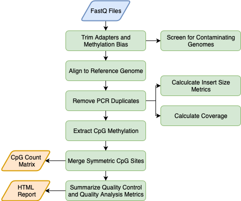

# CpG_Me
#### A whole genome bisulfite sequencing (WGBS) alignment pipeline for the analysis of DNA methylation

CpG_Me is an optimized and comprehensive WGBS alignment pipeline for a SLURM job scheduler on a high-performance computing cluster. CpG_Me takes you from raw fastq files to CpG methylation count matrices (Bismark cytosine reports), where it preprocesses data to remove biases and provides ample QC/QA. Scripts are available for both paired end (PE) and single end (SE) sequencing approaches. The extracted CpG methylation count matrices can be then be used for the identification of differentially methylated regions (DMRs) through the accompanying [DMRichR](https://github.com/ben-laufer/DMRichR) workflow.

### Table of Contents

0. [Overview](https://github.com/ben-laufer/CpG_Me#overview)
1. [Quick Start](https://github.com/ben-laufer/CpG_Me#quick-start)
2. [Installation](https://github.com/ben-laufer/CpG_Me#installation)
3. [Chastity Filtering](https://github.com/ben-laufer/CpG_Me#chastity-filtering)
4. [Merging Lanes](https://github.com/ben-laufer/CpG_Me#merging-lanes)
5. [Correcting for Methylation Bias (m-bias)](https://github.com/ben-laufer/CpG_Me#correcting-for-methylation-bias-m-bias)
   1. [Paired End (PE)](https://github.com/ben-laufer/CpG_Me#paired-end)
   2. [Single End (SE)](https://github.com/ben-laufer/CpG_Me#single-end)
   3. [M-Bias Examples](https://github.com/ben-laufer/CpG_Me#m-bias-examples)
6. [Paired End (PE) Sequencing](https://github.com/ben-laufer/CpG_Me#paired-end-pe-sequencing)
7. [Single End (SE) Sequencing](https://github.com/ben-laufer/CpG_Me#single-end-se-sequencing)
8. [QC Report](https://github.com/ben-laufer/CpG_Me#qc-report)
9. [DMR Calling](https://github.com/ben-laufer/CpG_Me#dmr-calling)
10. [Citation](https://github.com/ben-laufer/CpG_Me#citation)
11. [Publications](https://github.com/ben-laufer/CpG_Me#publications)
12. [Acknowledgements](https://github.com/ben-laufer/CpG_Me#acknowledgements)

## Overview

A single command line call performs the following steps for all samples:



A final command line call generates html QC/QA reports for all samples that easily enables the identification of failed samples and specifically what went wrong.

## Quick Start

Assuming everything is installed and that you have paired-end 150 bp reads from the NovaSeq, where Swift's Accel-NGS Methyl-Seq Kit kit was used for library preparation, all you need to do is change to your working directory and run the following command for the human genome:

`sbatch --array=1-96 /share/lasallelab/programs/CpG_Me/Paired-end/CpG_Me_PE_controller.sh  hg38`

Once your alignments are complete, you can generate the overall QC/QA report with the following command:

`sbatch /share/lasallelab/programs/CpG_Me/Paired-end/CpG_Me_PE_QC.sh` 

## Installation

This workflow utilizes the following packages, which need to be installed and in your path:
1. [Trim Galore!](https://github.com/FelixKrueger/TrimGalore)
2. [Bismark](https://github.com/FelixKrueger/Bismark)
3. [Bowtie 2](http://bowtie-bio.sourceforge.net/bowtie2/index.shtml)
4. [FastQ Screen](https://www.bioinformatics.babraham.ac.uk/projects/fastq_screen/)
5. [Samtools](http://www.htslib.org)
6. [Picard Tools](https://broadinstitute.github.io/picard/)
7. [MultiQC](http://multiqc.info)

I recommend using [Bioconda](https://bioconda.github.io) to install and manage the package updates, which can be accomplished by:

`conda install -c bioconda trim-galore bismark fastq-screen picard multiqc`

Bisulfite converted genomes will also have to be created and placed in an external folder for the genome of interest as well as the genomes you would like to use to screen for contamination. This can be accomplished by using `bismark_genome_preperation`, which is detailed in the [Bismark docs](https://github.com/FelixKrueger/Bismark/tree/master/Docs), and example scripts are available in the [Genome_preperation folder](Genome-preperation) of this repository. These scripts expect that each bisulfite converted genome is located in a `genomes` folder, which contains a folder for each genome within it (i.e. `hg38`). However, you can also download the prepared indices for a number of genomes via FastQ Screen with the command `fastq_screen --bisulfite --get_genomes`.

The genome folder structure should appear as:

```
├── genomes
│   ├── hg38
│   │   ├── Bisulfite_Genome
│   │   │   ├── CT_conversion
│   │   │   ├── GA_conversion
│   │   ├── Bowtie2
│   │   ├── hg38.fa
│   │   ├── hg38.fa.fai
│   ├── mm10
│   │   ├── Bisulfite_Genome
│   │   │   ├── CT_conversion
│   │   │   ├── GA_conversion
│   │   ├── Bowtie2
│   │   ├── mm10.fa
│   │   ├── mm10.fa.fai
```

The paths will also need to be changed in the `controller`, `switch`, and `QC` scripts through the `mainPath` variable, where for our environment they begin with `/share/lasallelab/` and the scripts themselves are located in the `programs` folder. Finally, the paths will also need to be changed in `fastq_screen.conf` and `multiqc_config.yaml` configuration files.

The overall folder structure should appear as:

```
├── programs
│   ├── CpG_Me
│   │   ├── Genome-preperation
│   │   ├── Paired-end
│   │   ├── Single-end
│   │   ├── fastq_screen.conf
│   │   ├── README.md
│   │   ├── LICENSE
├── genomes
│   ├── hg38
│   ├── mm10
```

## Chastity Filtering

This workflow assumes your data is Illumina quality/chastity filtered, which service providers these days will do by default. So, this step is a vestige for very old HiSeq data, and is something you probably don't need to worry about for new datasets.

You can check by using the following command, where file.fastq.gz represents your file:

`zcat BL001.fastq.gz | head -n 50`

Essentially, you want to make sure all your reads contain `:N:` and none contain `:Y:`. If your reads aren’t chastity filtered you can accomplish this on command line via the command below, where you change BL001 to your sample name (see [ref](https://github.com/stephenturner/oneliners#find-xargs-and-gnu-parallel)):

`zcat BL001*fastq.gz | zgrep -A 3 '^@.* [^:]*:N:[^:]*:' | zgrep -v "^--$" | gzip > BL001_filtered.fq.gz`

## Merging Lanes

For large-scale studies, there are often more samples than can fit on a single lane of sequencing. Even the NovaSeq has its limits and we generally recommend not to pool more than 48 samples per a NovaSeq lane for this low-coverage WGBS workflow. However, lane effects are a significant source of [batch effects](https://www.ncbi.nlm.nih.gov/pmc/articles/PMC3880143/) in any high-throughput sequencing experiment. In order to combat this source of technical bias, which can produce an effect stronger than biological signal, we create a large library pool (up to 96 samples with dual indices) and then repeatedly sequence that library pool across multiple lanes. A MiSeq run of this pool is also a great QC/QA step that helps with balancing the library pool before the large sequencing commitment.

Once you have your sequencing results, the most straightforward approach to merging the results of multiple lanes of data for the same sample is as follows (see [ref](https://www.biostars.org/p/317385/) and [FASTQ_Me](https://github.com/ben-laufer/FASTQ_Me)):

1. Check for the right number of unique sample IDs for both R1 and R2

```
countFASTQ(){
	awk -F '_' '{print $1}' | \
	sort -u | \
	wc -l
}
export -f countFASTQ

R1=`ls -1 *R1*.gz | countFASTQ`
R2=`ls -1 *R2*.gz | countFASTQ`

if [ ${R1} = ${R2} ]
then
        lanes=`ls -1 *R1*.gz | \
        awk -F '_' '{print $1}' | \
        sort | \
        uniq -c | \
        awk -F ' ' '{print $1}' | \
        sort -u`
        echo "${R1} samples sequenced across ${lanes} lanes identified for merging"
else
        echo "ERROR: There are ${R1} R1 files and ${R2} R2 files"
        exit 1
fi
```

2. Create file of unique IDs based on _ delimiter and first string (use file for CpG_Me)

```
ls -1 *fastq.gz | \
awk -F '_' '{print $1}' | \
sort -u > \
task_samples.txt
```

3. Test merge commands for each read (look over each one carefully)
```
mergeLanesTest(){
	i=$1
	echo cat ${i}\_*_R1_001.fastq.gz \> ${i}\_1.fq.gz
	echo cat ${i}\_*_R2_001.fastq.gz \> ${i}\_2.fq.gz
}
export -f mergeLanesTest
cat task_samples.txt | parallel --jobs 6 --will-cite mergeLanesTest
```

4. Use merge commands for each read by removing echo and the escape character on >
```
mergeLanes(){
	i=$1
	cat ${i}\_*_R1_001.fastq.gz > ${i}\_1.fq.gz
	cat ${i}\_*_R2_001.fastq.gz > ${i}\_2.fq.gz
}
export -f mergeLanes
cat task_samples.txt | parallel --jobs 6 --verbose --will-cite  mergeLanes
```

Now, not only are your samples merged across lanes, but you now also have your `task_samples.txt` file for the next steps. If your data is single end then you need to modify accordingly, where you will also need to slightly modify the `task_samples.txt` file after too.

## Correcting for Methylation Bias (m-bias)
[Methylation bias (m-bias)](https://github.com/FelixKrueger/Bismark/tree/master/Docs#m-bias-plot) is a technical artifact where the 5' and 3' ends of reads contain artificial methylation levels due to the library preparation method (see Figure 2 in [Hansen *et al.*](https://www.ncbi.nlm.nih.gov/pubmed/23034175)). One example is the random priming used in post-bisulfite adapter tagging (PBAT) methods (read more [here](https://sequencing.qcfail.com/articles/mispriming-in-pbat-libraries-causes-methylation-bias-and-poor-mapping-efficiencies/)). In paired-end sequencing approaches, the m-bias can also differ between reads 1 and 2 (read more [here](https://sequencing.qcfail.com/articles/library-end-repair-reaction-introduces-methylation-biases-in-paired-end-pe-bisulfite-seq-applications/)). Therefore, it is important to always examine for this bias in the MultiQC reports. CpG m-bias can be used to guide trimming options, while CpH m-bias can be used to judge for incomplete bisulfite conversion. In our experience, we have come across the following parameters, although we recommend to examine every dataset, particularly when trying a new library preparation method or sequencing platform. In paired end approaches, the 5' end of read 2 tends to show the largest m-bias. 

To address m-bias, the following parameters should be customized in the `CpG_Me_switch.sh` script:

### Paired End (PE)

| Library preparation kit               | clip_r1 | clip_r2 | three_prime_clip_r1  | three_prime_clip_r2 | 
| ------------------------------------- | ------- | ------- | -------------------- | ------------------- | 
| Accel-NGS Methyl-Seq Kit (Swift)      | 10      | 20      | 10                   | 10                  |
| TruSeq DNA Methylation Kit (EpiGnome) | 8       | 20      | 8                    | 8                   |

### Single End (SE)

| Library preparation kit               | clip_r1 | three_prime_clip_r1  | 
| ------------------------------------- | ------- | -------------------- | 
| TruSeq DNA Methylation Kit (EpiGnome) | 8       |  8                   | 
| MethylC-Seq (Original Method)         | 7       |  10                  |

### M-Bias Examples

**Read 1**


**Read 2**


## Paired End (PE) Sequencing
1.	Create a parent directory for the project
2.	Within that parent project directory, add a text file called “task_samples.txt”, where each new line contains the entire sample name exactly as it appears on the fastq read pair files, aside from the end part (“_1.fq.gz” or “_2.fq.gz”). Only name a sample once, NOT twice, and make sure it is .fq.gz and not fastq.gz. Also, if you’re using excel or a windows desktop, you will need to change the linebreaks from windows to unix, which can be done using BBedit (File > Save As... > Line Breaks > Unix) or on command line (but make sure the files have different names):

 `awk '{ sub("\r$", ""); print }' task_samples_windows.txt > task_samples.txt`
 
3.	Within that parent directory create a folder called “raw_sequences” that contains all raw paired fastq files (sampleID_1.fq.gz and sampleID_2.fq.gz)

Overall, the directory tree structure should be the following:

```
├── Project
│   ├── raw_sequences
│   │   ├── sample1_1.fq.gz
│   │   ├── sample1_2.fq.gz
│   │   ├── sample2_1.fq.gz
│   │   ├── sample2_2.fq.gz
│   ├── task_samples.txt
```

4. Ensure the trimming options in the [switch script](Paired-end/CpG_Me_PE_switch.sh) are appropriate for the [Methylation Bias (m-bias) of your library preparation method](https://github.com/ben-laufer/CpG_Me#correcting-for-methylation-bias-m-bias) as well as your sequencing chemistry. The HiSeq and MiSeq series of sequencers use a 4 color chemistry, while NovaSeq and NextSeq series use a 2 color chemistry. For a 4 color chemistry you should use `--quality 20`, while for 2 color chemistry you should use `--2colour 20`.

Now with that structure in place it’s ready to run, so FROM the parent directory, modify and run this command:

`sbatch --array=1-12 /share/lasallelab/programs/CpG_Me/Paired-end/CpG_Me_PE_controller.sh  hg38`

Let’s break this apart:
1)	sbatch is how you submit a job to a HPCC with a slurm workload manager
2)	--array=12 lets you specify the number of samples, as well as subset. Here we are running samples 1 to 12. You could run select samples using the following format --array=2,4-12
3)	The next call is the location of the executable shell script that will schedule all jobs with proper resources and dependencies on a per sample basis
4)	Genome (hg38, rheMac8, mm10, rn6)

## Single End (SE) Sequencing
For single end sequencing, follow the same approach as paired end with minor changes.

The directory should appear as:

```
├── Project
│   ├── raw_sequences
│   │   ├── sample1.fq.gz
│   │   ├── sample2.fq.gz
│   ├── task_samples.txt
```

The calls to the scripts would be:

`sbatch --array=1-12 /share/lasallelab/programs/CpG_Me/Single-end/CpG_Me_SE_controller.sh  hg38`

## QC Report
There is also a final html QC report that should be run AFTER all samples have finished, which you also need to launch from the working directory. 
To generate the QC report for paired end sequencing data, the command is:

`sbatch /share/lasallelab/programs/CpG_Me/Paired-end/CpG_Me_PE_QC.sh` 

To generate the QC report for single end sequencing data, the command is:

`sbatch /share/lasallelab/programs/CpG_Me/Single-end/CpG_Me_SE_QC.sh` 

An [example report](Examples/multiqc_report.html) for single end sequencing is available in the `Examples` folder. There is currently a minor glitch in the paired end reports, where the temporary files for the different reads create empty columns. This can be fixed by clicking on the configure columns button above the general statistics table and re-selecting one of the visibile columns. Also, these reports can be customized by modifying the multiqc_config.yaml files for the [paired end](Paired-end/multiqc_config_PE.yaml) and [single end](Single-end/multiqc_config_SE.yaml) pipelines. 

## DMR Calling
Statistical testing for differentially methylated regions (DMRs) can be achieved by [DMRichR](https://github.com/ben-laufer/DMRichR), which utilizes the `cytosine_reports` folder created by CpG_Me. 

## Citation

If you use **CpG_Me** in published research please cite the 4 following articles:

Laufer BI, Hwang H, Jianu JM, Mordaunt CE, Korf IF, Hertz-Picciotto I, LaSalle JM. Low-Pass Whole Genome Bisulfite Sequencing of Neonatal Dried Blood Spots Identifies a Role for RUNX1 in Down Syndrome DNA Methylation Profiles. *Human Molecular Genetics*, 2020. **doi**: [10.1093/hmg/ddaa218](https://doi.org/10.1093/hmg/ddaa218)

Krueger F, Andrews SR. Bismark: a flexible aligner and methylation caller for Bisulfite-Seq applications. *Bioinformatics*, 2011. **doi**: [10.1093/bioinformatics/btr167](https://doi.org/10.1093/bioinformatics/btr167)

Matrin M. Cutadapt removes adapter sequences from high-throughput sequencing reads. *EMBnet.journal*, 2011. **doi**: [10.14806/ej.17.1.200](https://doi.org/10.14806/ej.17.1.200)

Ewels P, Magnusson M, Lundin S, Käller M. MultiQC: summarize analysis results for multiple tools and samples in a single report. *Bioinformatics*, 2016. **doi**: [10.1093/bioinformatics/btw354](https://doi.org/10.1093/bioinformatics/btw354)

## Publications

The following publications utilize **CpG_Me**:

Laufer BI, Gomez JA, Jianu JM, LaSalle, JM.  Stable DNMT3L Overexpression in SH-SY5Y Neurons Recreates a Facet of the Genome-Wide Down Syndrome DNA Methylation Signature. *bioRxiv* preprint, 2020. **doi**:[10.1101/2020.11.09.374793](https://doi.org/10.1101/2020.11.09.374793)

Mordaunt CE, Jianu JM, Laufer BI, Zhu Y, Dunaway KW, Bakulski KM, Feinberg JI, Volk HE, Lyall K, Croen LA, Newschaffer CJ, Ozonoff S, Hertz-Picciotto I, Fallin DM, Schmidt RJ, LaSalle JM. Cord blood DNA methylome in newborns later diagnosed with autism spectrum disorder reflects early dysregulation of neurodevelopmental and X-linked genes. *Genome Medicine*, 2020. **doi**: [10.1186/s13073-020-00785-8](https://doi.org/10.1186/s13073-020-00785-8)

Laufer BI, Hwang H, Jianu JM, Mordaunt CE, Korf IF, Hertz-Picciotto I, LaSalle JM. Low-Pass Whole Genome Bisulfite Sequencing of Neonatal Dried Blood Spots Identifies a Role for RUNX1 in Down Syndrome DNA Methylation Profiles. *Human Molecular Genetics*, 2020. **doi**: [10.1093/hmg/ddaa218](https://doi.org/10.1093/hmg/ddaa218)

Wöste M, Leitão E, Laurentino S, Horsthemke B, Rahmann S, Schröder C. wg-blimp: an end-to-end analysis pipeline for whole genome bisulfite sequencing data. *BMC Bioinformatics*, 2020. **doi**: [10.1186/s12859-020-3470-5](https://doi.org/10.1186/s12859-020-3470-5)

Lopez SJ, Laufer BI, Beitnere U, Berg E, Silverman JL, Segal DJ, LaSalle JM. Imprinting effects of UBE3A loss on synaptic gene networks and Wnt signaling pathways. *Human Molecular Genetics*, 2019. **doi**: [10.1093/hmg/ddz221](https://doi.org/10.1093/hmg/ddz221) 

Vogel Ciernia A*, Laufer BI*, Hwang H, Dunaway KW, Mordaunt CE, Coulson RL, Yasui DH, LaSalle JM. Epigenomic convergence of genetic and immune risk factors in autism brain. *Cerebral Cortex*, 2019. **doi**: [10.1093/cercor/bhz115](https://doi.org/10.1093/cercor/bhz115)

Laufer BI, Hwang H, Vogel Ciernia A, Mordaunt CE, LaSalle JM. Whole genome bisulfite sequencing of Down syndrome brain reveals regional DNA hypermethylation and novel disease insights. *Epigenetics*, 2019. **doi**: [10.1080/15592294.2019.1609867](https://doi.org/10.1080/15592294.2019.1609867)

## Acknowledgements
The development of this program was suppourted by a Canadian Institutes of Health Research (CIHR) postdoctoral fellowship [MFE-146824] and a [CIHR Banting postdoctoral fellowship](https://banting.fellowships-bourses.gc.ca/en/2018-2019-eng.html) [BPF-162684]. Contributions were made by [Hyeyeon Hwang](https://github.com/hyeyeon-hwang) and [Charles Mordaunt](https://github.com/cemordaunt). I would also like to thank [Matt Settles](https://github.com/msettles) and [Ian Korf](https://github.com/KorfLab) for invaluable discussions related to the bioinformatic approaches utilized in this repository. 
